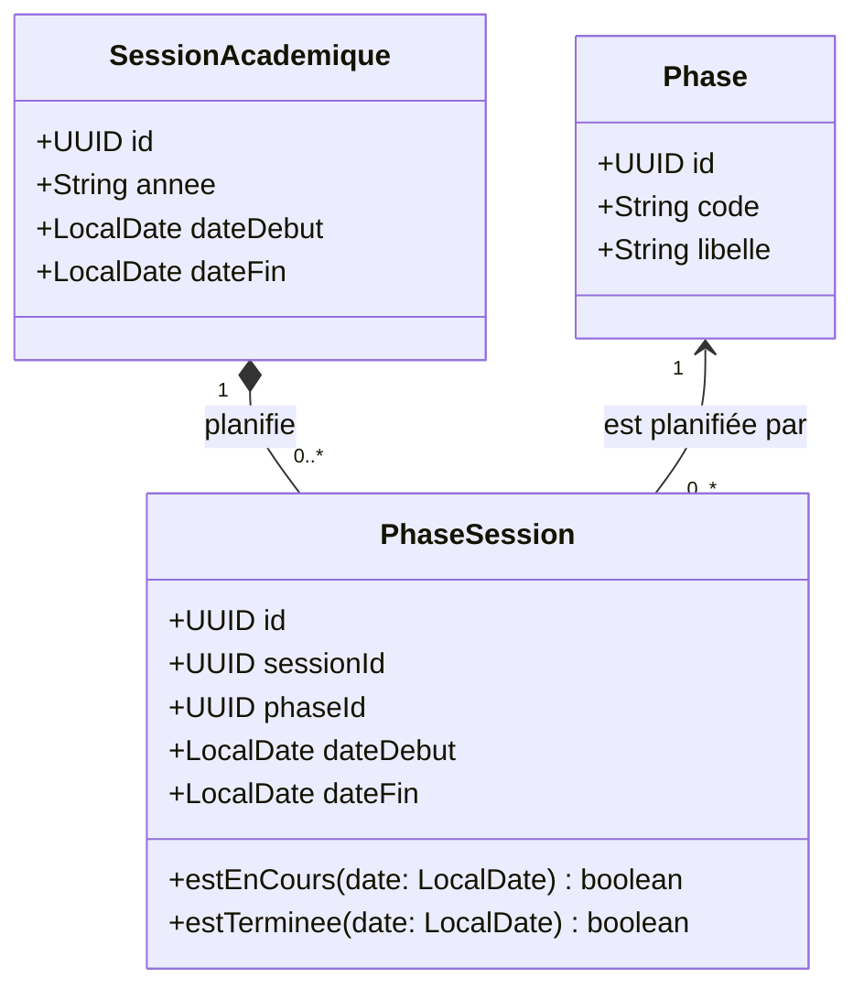
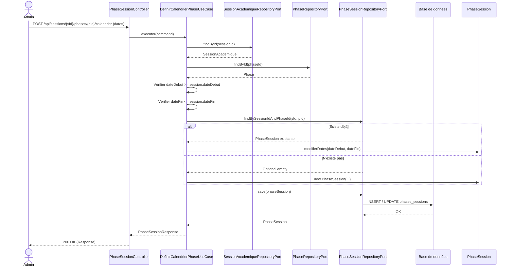
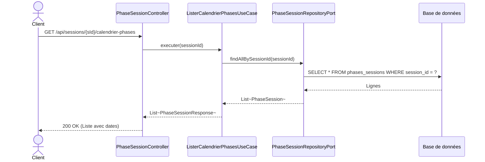
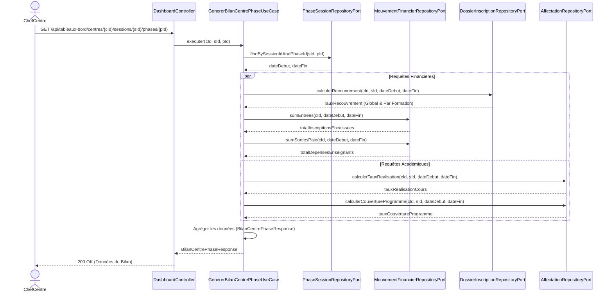
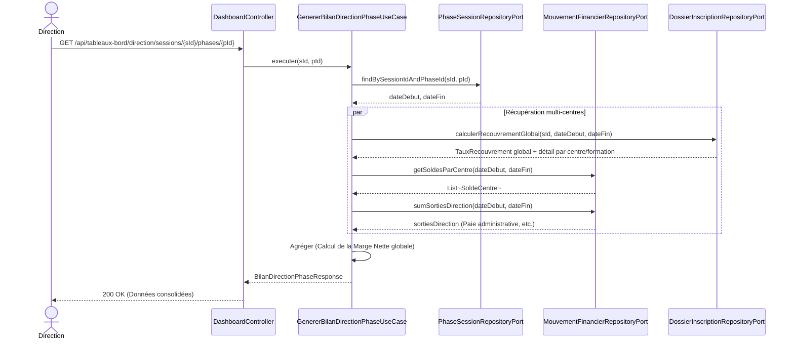

# Plan d'implémentation : Calendrier des Phases par Session (`PhaseSession`)

Ce document détaille l'ajout d'une dimension temporelle aux phases, permettant au système et aux utilisateurs (Directeurs, Comptables, Chefs de Centre) d'analyser l'activité pédagogique et financière **phase par phase** au sein d'une session.

---

## 1. Modélisation : Diagramme de Classes et Modèle de Données

Actuellement, une `Phase` est un simple dictionnaire (P1, P2). Nous introduisons `PhaseSession` (la table de liaison enrichie) pour porter le calendrier.

**Modèle de données (Table `phases_sessions`) :**
* `id` (UUID, PK)
* `session_id` (UUID, FK -> `sessions_academiques`)
* `phase_id` (UUID, FK -> `phases`)
* `date_debut` (DATE, Not Null)
* `date_fin` (DATE, Not Null)
* Contrainte : `UNIQUE (session_id, phase_id)` pour éviter les doublons.
* Contrainte : `date_fin >= date_debut`.

---

## 2. Mises à jour à effectuer dans le système

### Étape 1 : Domaine et Persistance (`PhaseSession`)
1. **Domaine :** Création du modèle `PhaseSession` dans le module `academie/phase/domain/model`.
2. **Ports IN :** `DefinirCalendrierPhaseUseCase`, `ListerCalendrierPhasesUseCase`.
3. **Port OUT :** `PhaseSessionRepositoryPort`.
4. **Persistance :** Création de `PhaseSessionEntity`, `PhaseSessionJpaRepository`, `PhaseSessionPersistenceMapper` et `PhaseSessionRepositoryAdapter`.

### Étape 2 : API Rest et Services
1. **Service :** Implémentation logicielle pour s'assurer qu'une date de phase ne dépasse pas les dates de sa `SessionAcademique` parente.
2. **Contrôleur REST :** 
   * `POST /api/sessions/{sessionId}/phases/{phaseId}/calendrier` (Définir/Modifier dates)
   * `GET /api/sessions/{sessionId}/calendrier-phases` (Lister le calendrier de l'année)

### Étape 3 : Migration Base de Données
1. **Flyway `V7__calendrier_phases_session.sql` :**
   Création de la table `phases_sessions` avec ses clés étrangères et contraintes d'intégrité.

### Étape 4 (Future/Parallèle) : Création des Tableaux de Bord par Phase et par Rôle
*(La mécanique analytique traitée ici s'appuiera sur la granularité des Affectations pour déduire le coût par centre, sans nécessiter de centreId sur le Bordereau de Paie global).*
Plutôt que d'avoir un seul endpoint générique, le système exposera plusieurs endpoints dédiés à chaque profil, afin de ne retourner que les données pertinentes pour chaque rôle.

**1. Pour le Responsable de Centre (`CHEF_CENTRE`)**
* **Endpoint :** `GET /api/tableaux-bord/centres/{centreId}/sessions/{sessionId}/phases/{phaseId}`
* **Ce qu'on y voit (Schéma de réponse) :**
  * `tauxRealisationCours` : (Séances payables / Séances planifiées).
  * `tauxCouvertureProgramme` : % d'avancement des progressions.
  * `tauxRecouvrement` : (Montant recouvré / Montant total attendu) consolidé pour le centre et détaillé par formation.
  * `totalInscriptionsEncaissees` : Somme des `Entree` sur la période de la phase.
  * `totalDepensesEnseignants` : Somme des `Sortie` liées aux `BordereauPaie` émis sur la période.

**2. Pour le Directeur Académique (`DIRECTEUR_ACADEMIQUE`)**
* **Endpoint :** `GET /api/tableaux-bord/academique/sessions/{sessionId}/phases/{phaseId}`
* **Ce qu'on y voit (Schéma de réponse) :**
  * `couvertureParCentre` : Liste des centres avec leur % d'avancement du programme.
  * `matieresEnRetard` : Liste des matières où l'avancement est inférieur à X% par rapport aux semaines écoulées.
  * `volumeHeuresEnseignees` : Total des heures d'affectations honorées, consolidé par formation.

**3. Pour le Comptable (`COMPTABLE`)**
* **Endpoint :** `GET /api/tableaux-bord/comptable/sessions/{sessionId}/phases/{phaseId}`
* **Ce qu'on y voit (Schéma de réponse) :**
  * `grandLivrePhase` : Liste consolidée des `BilanJournalier` clôturés sur les dates de la phase.
  * `tauxRecouvrementGlobal` : Taux de recouvrement consolidé sur tous les centres, avec le détail par centre.
  * `totalEntreesGlobales` / `totalSortiesGlobales`.
  * `soldesParCentre` : Le solde net (Entrées - Sorties) généré par chaque centre durant cette seule phase.
  * `sortiesDirection` : Les sorties globales (ex: paie du personnel administratif) rattachées à la phase.

**4. Pour le Directeur Général (`DIRECTEUR_GENERAL`)**
* **Endpoint :** `GET /api/tableaux-bord/direction/sessions/{sessionId}/phases/{phaseId}`
* **Ce qu'on y voit (Schéma de réponse) :** Agrégation des indicateurs clés (Marge nette, Top 3 centres, Taux de recouvrement global/par centre/par formation).

---

## 4. Diagrammes de Séquence Techniques

### 4.1. Paramétrage de la PhaseSession (Étapes 1 à 3)

**1. Définir ou Modifier le Calendrier d'une Phase** (`POST /api/sessions/{sId}/phases/{pId}/calendrier`)

Ce flux permet de créer ou de mettre à jour les dates (`dateDebut`, `dateFin`) d'une phase pour une session donnée. La vérification métier s'assure que les dates de la phase restent dans les bornes temporelles de la session parente.

**2. Consulter le Calendrier Complet d'une Session** (`GET /api/sessions/{sId}/calendrier-phases`)

Ce flux renvoie toutes les phases de l'année avec leurs dates pour une session précise.

### 4.2. Requêtage des Tableaux de Bord (Étape 4)

**A. Tableau de bord Centre (Responsable Centre)**

**B. Tableau de bord Direction / Comptabilité (Agrégation globale)**

---

## 5. Les questions auxquelles nous pourrons désormais répondre

Dès que ce modèle sera actif, les différents acteurs pourront interroger le système sur des fenêtres de tir très précises :

### 🏫 Pour les Chefs de Centre (Gestion Quotidienne)
**Endpoint exploité :** `GET /api/tableaux-bord/centres/{centreId}/sessions/{sessionId}/phases/{phaseId}`
* *"Combien d'inscriptions ont été encaissées spécifiquement durant la Phase 1 ?"* (via `totalInscriptionsEncaissees`)
* *"Quel est notre taux de recouvrement sur cette phase, globalement et par formation ?"* (via `tauxRecouvrement`)
* *"Où en sommes-nous sur l'avancement des cours de la Phase 1 ?"* (via `tauxCouvertureProgramme`)

### 💰 Pour la Comptabilité (Rapprochement et Clôture)
**Endpoint exploité :** `GET /api/tableaux-bord/comptable/sessions/{sessionId}/phases/{phaseId}`
* *"Quel est le taux de recouvrement consolidé du réseau ?"* (via `tauxRecouvrementGlobal`)
* *"Le solde de trésorerie rapporté à la Phase 1 correspond-il aux attentes ?"* (via `totalEntreesGlobales` / `totalSortiesGlobales`)

### 📚 Pour la Direction Académique (Suivi Pédagogique)
**Endpoint exploité :** `GET /api/tableaux-bord/academique/sessions/{sessionId}/phases/{phaseId}`
* *"Quels centres n'ont pas terminé le programme prévu pour la Phase 1 (date de fin dépassée) ?"* (via `couvertureParCentre`)

### 🏛️ Pour la Direction Générale (Consolidation)
**Endpoint exploité :** `GET /api/tableaux-bord/direction/sessions/{sessionId}/phases/{phaseId}`
* *"Quels sont les centres et les formations qui ont les meilleurs taux de recouvrement ?"* 
* *"Quelle est la marge opérationnelle nette de la Phase 1 tous centres confondus ?"*

---

**→ Ce plan valide l'intégration du calendrier de phase en gardant l'architecture modulaire hexagonale intacte. Confirmez-vous le lancement de l'implémentation ?**
